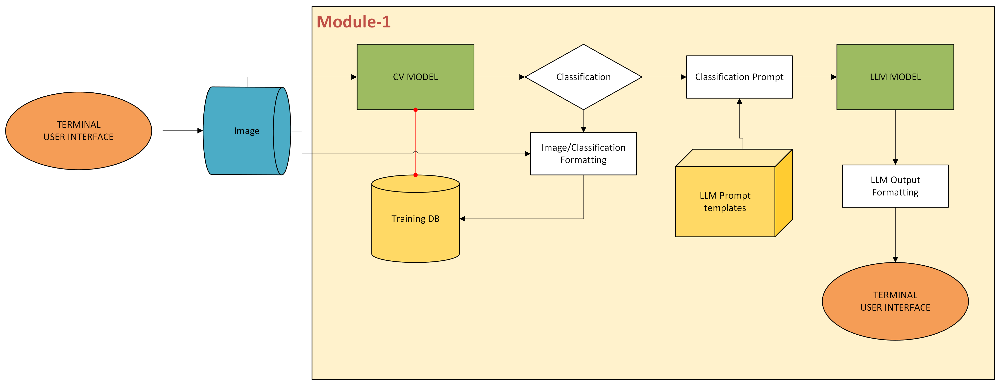
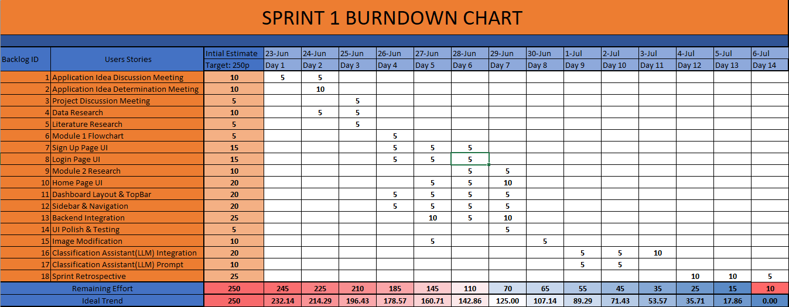
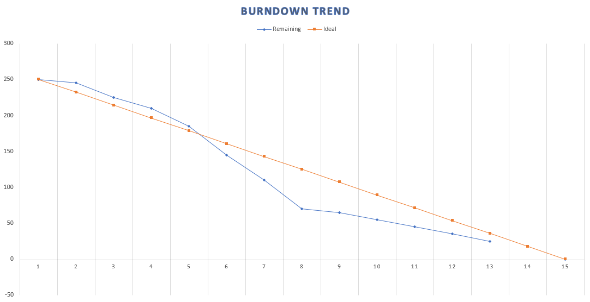

# 🧠 DERMIN (AI-Based Skin Health Analyzer)

An AI-powered web/mobile application that detects common skin conditions? (e.g., acne, eczema, hair loss) through image analysis, and provides personalized care insights using LLM-enhanced explanations.

---

## 👥 Team Members

| Name            | Title               |
|-----------------|---------------------|
| Ekin Karabulut   |Scrum Master    |
| Enes Türköz      | Developer  |
| Kubilay Karaçar  | Developer  |
| Özgün Büyüktanır |   Product Owner     |

---

## 📦 Product Description

This project aims to develop a multi-functional AI application that:
- Detects **skin diseases** using deep learning 
- Provides personalized recommendations based on detected results
- Stores and refines data continuously for active learning

---

## 🚀 Features

- ✅ Skin disease detection 
- ✅ Skin type classification via LLM-enhanced prompt generation
- ✅ Training data enrichment and feedback loop

---

## 🎯 Target Audience

- Dermatologists and healthcare professionals
- Patience
- Cosmetic product consultants
- Individuals seeking skin/hair health insights
- Telemedicine platforms and mobile health apps

---

## 🔁 Development Sprints

<h3>🔁 Sprint 1</h3>

### 🎯 Objectives
- Decide Project Idea
- Decide Model
- Decide Training Data
- Frontend Integration
- Backend Integration

### 🔀 Flowchart

👥 Meeting Notes

## **Meeting 1 (23/06/2025)**
- Team introductions  
- Initial discussion on project ideas  

## **Meeting 2 (24/06/2025)**
- Finalized project topic: **Dermatology Image Recognition**  
- Discussed suitable datasets for training  
- Selected the computer vision model to be used  

## **Meeting 3 (25/06/2025)**
- Performed initial model testing  
- Chose a project management application  
- Prepared the burndown chart  

## **Meeting 4 (27/06/2025)**
- Finalized the project name  
- Compiled the `README.md` file  
- Initialized the Git repository  

## **Meeting 5 (30/06/2025)**
- Reviewed frontend and backend development progress  
- Discussed integration between backend and AI components  

## **Meeting 6 (04/07/2025)**
- Integrated chatbot functionality
- Retrospective   

## **Meeting 7 (05/07/2025)**
- Retrospective
- Sprint 2 planning

⭐ Burndown Chart

📝 Sprint Notes

## 📝 Sprint Notes

- Scrum meetings were conducted using **WhatsApp** and **Microsoft Teams**.  
- **Jira** was selected as the primary project management tool.  
- The application interface language was set to **English**.  
- **YOLOv8** was chosen as the object detection model.  
- **Gemini** was selected as the Large Language Model (LLM) for integration.  
- **Daily Scrum** meetings were held regularly, and screenshots of backlogs and meetings were documented.

## 🧠 Point Allocation Logic

- **Sprint 1** was dedicated to research, frontend development, and a small portion of the backend.  
  It was estimated to require approximately **25–30%** of the total project effort.  
  The total effort allocated to Sprint 1 was set at **250 points**.

- **Sprint 2** focused on the development of:
  - **Module 1**: Image Classification
  - **Module 2**: User Segmentation with LLM-powered Chatbot  
  This sprint was estimated to cover roughly **40%** of the total effort, with **350 points** allocated.

- **Sprint 3** will be dedicated to completing delayed tasks and polishing the product.  
  It was planned to represent the remaining **30%** of the total effort, with **300 points** assigned.

### 📊 Total Effort

The project was estimated to require **900 points** of total effort, distributed across three sprints as follows:

- **Sprint 1**: 250 points (~27.78%)  
- **Sprint 2**: 350 points (~38.89%)  
- **Sprint 3**: 300 points (~33.33%)

## Daily Scrum:[Backlogs and Meeting Images](Project_Management/sprint_1/backlogs)

## Product Backlog URL: [Jira](https://querriqe.atlassian.net/jira/software/projects/BACKLOG/boards/36)

## ✒️ Sprint Review

- Choosing the project name was particularly challenging.  
- Due to hardware limitations, AI model training was postponed to **Sprint 2**.  
- Because of the frequency of meetings, **Jira** was also used to generate a **burndown chart**.

## 👥 Sprint Review Participants

- Ekin Karabulut  
- Enes Türköz  
- Kubilay Karaçar  
- Özgün Büyüktanır

## 🔁 Sprint Retrospective

- It was decided to design the **application logo** in Sprint 2.  
- Training of the AI model was prioritized for the next sprint.  
- Backend and AI module integration was planned.  
- A **KVKK (Personal Data Protection Law)** notice will be added to the homepage.  
- A prototype for the AI and LLM pipeline will be created.  
- A **color palette** for the application's theme will be selected.

---

