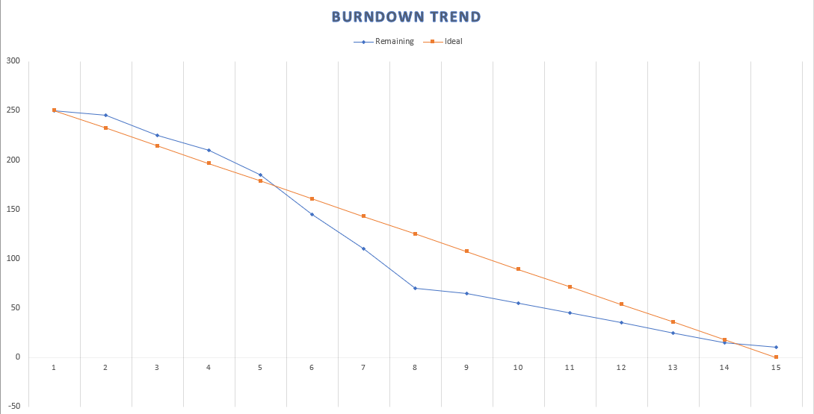
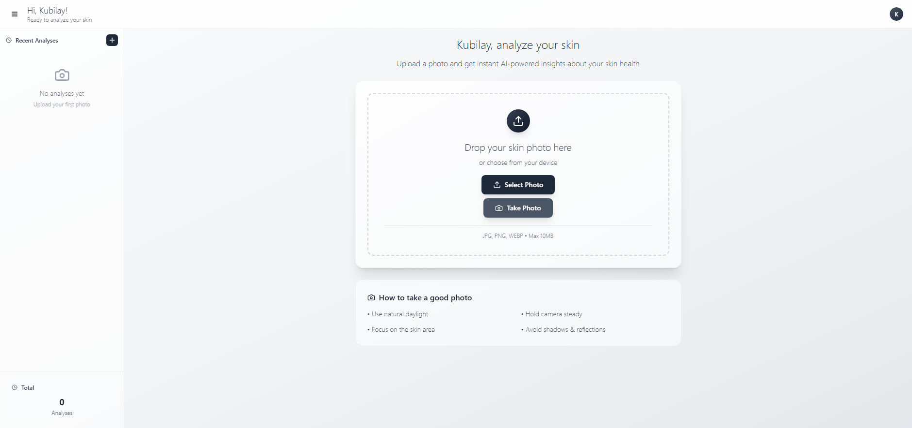
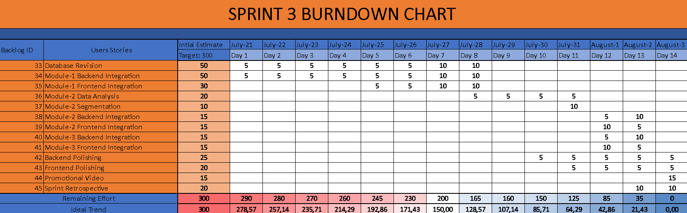

# 🧠 DERMIN (AI-Based Skin Health Analyzer)

An AI-powered web/mobile application that detects common skin conditions? (e.g., acne, eczema, hair loss) through image analysis, and provides personalized care insights using LLM-enhanced explanations.

---

## 👥 Team Members

| Name            | Title               |
|-----------------|---------------------|
| Ekin Karabulut   |Scrum Master    |
| Enes Türköz      | Developer  |
| Kubilay Karaçar  | Developer  |
| Özgün Büyüktanır |   Product Owner     |

---

## 📦 Product Description

This project aims to develop a multi-functional AI application that:
- Detects **skin diseases** using deep learning 
- Provides personalized recommendations based on detected results
- Stores and refines data continuously for active learning

## ❗ Problem Statement  
 
Skin conditions, lesions, and wounds are among the most common health issues affecting people worldwide. Many individuals delay or avoid consulting a dermatologist due to cost, accessibility issues, or the belief that their condition is not serious. This delay can lead to worsening of the condition, increased healthcare costs, and negative impacts on overall well-being.  
 
Additionally, people often struggle to get timely appointments with dermatologists at hospitals, facing long waiting lists and overcrowded clinics. Even when appointments are available, consultations can be expensive, creating a barrier for those who need early evaluation and care.  
 
There is currently a lack of accessible, reliable, and easy-to-use digital tools that can help users identify potential skin issues early and guide them toward appropriate care. While some applications offer basic skin analysis, they are often limited in accuracy, lack real-time updates, or fail to provide actionable recommendations for users.  
 
To address this gap, we designed **Dermin**, a web application powered by artificial intelligence. Dermin allows users to capture images of their skin lesions or conditions, classifies them using advanced computer vision models, and provides tailored recommendations and guidance. By combining AI-driven classification with user-friendly design, Dermin aims to improve early detection, increase awareness, and make dermatological support more accessible to everyone.

 
## 🎯 Objectives  
 
- To create an accessible and intuitive web application that allows users to take photos of their skin conditions easily.  
- To classify skin lesions, wounds, or conditions using a reliable and updatable AI model.  
- To provide users with meaningful insights, suggestions, and guidance for further medical attention if necessary.  
- To continuously improve the AI model and segmentation through feedback loops and new user data.  
- To make dermatological support more inclusive, affordable, and available beyond traditional healthcare settings.
 

---

## 🚀 Modules
 
- Module-1 : Yolo based classification
- Module-2: Survey based user segmentation
- Module-3: Dermatology themed chatbot

---

## 💼 Target Audience

- Dermatologists and healthcare professionals
- Patience
- Cosmetic product consultants
- Individuals seeking skin/hair health insights
- Telemedicine platforms and mobile health apps

---

## 🔁 Development Sprints

<h3>🔁 Sprint 1</h3>

### 🎯 Objectives
- Decide Project Idea
- Decide Model
- Decide Training Data
- Frontend Integration
- Backend Integration

### 🔀 Flowchart

👥 Meeting Notes

## **Meeting 1 (23/06/2025)**
- Team introductions  
- Initial discussion on project ideas  

## **Meeting 2 (24/06/2025)**
- Finalized project topic: **Dermatology Image Recognition**  
- Discussed suitable datasets for training  
- Selected the computer vision model to be used  

## **Meeting 3 (25/06/2025)**
- Performed initial model testing  
- Chose a project management application  
- Prepared the burndown chart  

## **Meeting 4 (27/06/2025)**
- Finalized the project name  
- Compiled the `README.md` file  
- Initialized the Git repository  

## **Meeting 5 (30/06/2025)**
- Reviewed frontend and backend development progress  
- Discussed integration between backend and AI components  

## **Meeting 6 (04/07/2025)**
- Integrated chatbot functionality
- Retrospective   

## **Meeting 7 (05/07/2025)**
- Retrospective
- Sprint 2 planning

⭐ Burndown Chart

📸 App Screenshots 

📝 Sprint Notes

## 📝 Sprint Notes

- Scrum meetings were conducted using **WhatsApp** and **Microsoft Teams**.  
- **Jira** was selected as the primary project management tool.  
- The application interface language was set to **English**.  
- **YOLOv8** was chosen as the object detection model.  
- **Gemini** was selected as the Large Language Model (LLM) for integration.  
- **Daily Scrum** meetings were held regularly, and screenshots of backlogs and meetings were documented.

## 🧠 Point Allocation Logic

- **Sprint 1** was dedicated to research, frontend development, and a small portion of the backend.  
  It was estimated to require approximately **25–30%** of the total project effort.  
  The total effort allocated to Sprint 1 was set at **250 points**.

- **Sprint 2** focused on the development of:
  - **Module 1**: Image Classification
  - **Module 2**: User Segmentation with LLM-powered Chatbot  
  This sprint was estimated to cover roughly **40%** of the total effort, with **350 points** allocated.

- **Sprint 3** will be dedicated to completing delayed tasks and polishing the product.  
  It was planned to represent the remaining **30%** of the total effort, with **300 points** assigned.

### 📊 Total Effort

The project was estimated to require **900 points** of total effort, distributed across three sprints as follows:

- **Sprint 1**: 250 points (~27.78%)  
- **Sprint 2**: 350 points (~38.89%)  
- **Sprint 3**: 300 points (~33.33%)

## Daily Scrum:[Backlogs and Meeting Images](Project_Management/sprint_1/backlogs)

## Product Backlog URL: [Jira](https://querriqe.atlassian.net/jira/software/projects/BACKLOG/boards/36)

## ✒️ Sprint Review

- Choosing the project name was particularly challenging.  
- Due to hardware limitations, AI model training was postponed to **Sprint 2**.  
- Because of the frequency of meetings, **Jira** was also used to generate a **burndown chart**.

## 👥 Sprint Review Participants

- Ekin Karabulut  
- Enes Türköz  
- Kubilay Karaçar  
- Özgün Büyüktanır

## 🔁 Sprint Retrospective

- It was decided to design the **application logo** in Sprint 2.  
- Training of the AI model was prioritized for the next sprint.  
- Backend and AI module integration was planned.  
- A **KVKK (Personal Data Protection Law)** notice will be added to the homepage.  
- A prototype for the AI and LLM pipeline will be created.  
- A **color palette** for the application's theme will be selected.

---

<h3>🔁 Sprint 2</h3>

### 🎯 Objectives
- Train Demo Model
- Optimize Model
- Train First Model
- Database Integration
- Backend Update
- Module-2 (*Survey Based Segmentation*) Research
- Module-3 (*Chatbot*) Integration
- Decide Logo

👥 Meeting Notes

## **Meeting 1 (06/07/2025)**
- Sprint 2 task distribution   

## **Meeting 2 (12/07/2025)**
- YOLO demo progression discussion
- Database structure discussion

## **Meeting 3 (13/07/2025)**
- Logo design and color palette discussion
- Module-2 main idea determination

## **Meeting 4 (16/07/2025)**
- Backend and database structure review
- YOLOv8n model presentation
- LOGO determination 

## **Meeting 5 (17/07/2025)**
- Backend and database review
- YOLOv8s model review
  
## **Meeting 6 (18/07/2025)**
- Sprint 2 review
- Retrospective  
- Chatbot integration review

## **Meeting 7 (19/07/2025)**
- Retrospective
- Sprint 3 planning

⭐ Burndown Chart

📈 MLFlow Graphs 

📝 Sprint Notes

## 📝 Sprint Notes

- **YOLOv8n** was selected for demonstration purposes.
- **YOLOv8s** was trained and finalized as the main model.
- **Module-2** was designed as a survey-based user segmentation module and will be integrated with **Module-1** and **Module-3** to provide personalized data flow.
- The database was migrated from **Firebase** to **MongoDB** due to Firebase's pay-as-you-go pricing policy.
- The project logo and color palette have been *temporarily* finalized and are subject to *future revisions*.
- **Daily Scrum** meetings were conducted regularly, with screenshots of backlogs and meetings properly documented.

## 🧠 Point Allocation Logic

- **Sprint 1** was dedicated to research, frontend development, and a small portion of the backend.  
  It was estimated to require approximately **25–30%** of the total project effort.  
  The total effort allocated to Sprint 1 was set at **250 points**.

- **Sprint 2** focused on the development of:
  - **Module 1**: Image Classification
  - **Module 2**: User Segmentation
  - **Module 3**: LLM-powered Chatbot 
  This sprint was estimated to cover roughly **40%** of the total effort, with **350 points** allocated.

- **Sprint 3** will be dedicated to completing delayed tasks and polishing the product.  
  It was planned to represent the remaining **30%** of the total effort, with **300 points** assigned.

### 📊 Total Effort

The project was estimated to require **900 points** of total effort, distributed across three sprints as follows:

- **Sprint 1**: 250 points (~27.78%)  
- **Sprint 2**: 350 points (~38.89%)  
- **Sprint 3**: 300 points (~33.33%)

## Daily Scrum:[Backlogs and Meeting Images](Project_Management/sprint_2/backlogs)

## Product Backlog URL: [Jira](https://querriqe.atlassian.net/jira/software/projects/BACKLOG/boards/36)

## ✒️ Sprint Review

- It was concluded that the **YOLOv8n** model was weak for production use, and the team decided to switch to **YOLOv8s**. Transition to a higher-capacity model may be considered in the upcoming sprint.
- The dataset used for training the **YOLOv8s** model was found to be highly noisy. Therefore, data cleaning or the selection of a new, cleaner dataset is being considered.
- Due to local hardware limitations, training took a significantly long time. Cloud-based training solutions are currently being evaluated.
- The database structure has not been fully finalized. In **Sprint 3**, a final decision will be made, and the required backend integrations will be implemented.
- The targeted number of survey participants for **Module-2** has not yet been reached.
- The project logo will be selected through a voting process.

## 👥 Sprint Review Participants

- Ekin Karabulut  
- Enes Türköz  
- Kubilay Karaçar  
- Özgün Büyüktanır

## 🔁 Sprint Retrospective

- A **KVKK (Personal Data Protection Law)** notice will be added to the homepage.  
- If the required number of users is reached for **Module-2**, data analysis and segmentation will be performed, and the results will be integrated with other modules.
- **Module-3** chatbot integration will be finalized.
- It was agreed that the **database structure** and **backend connections** should be completed as soon as possible.
- The **frontend** will be updated based on the selected logo and color palette.
- Final polishing will be applied to the **YOLO model**, **backend**, and **frontend** components.

---

<h3>🔁 Sprint 3</h3>

### 🎯 Objectives
- Module-2 (*Survey Based Segmentation*)
- Data Analysis
- Module-3 (*Chatbot*) Integration
- *Backend* and *Frontend* components
- Polishing
- Promotional video 

👥 Meeting Notes

## **Meeting 1 (27/07/2025)**
- Design a survey to gather insights on people’s skin and hair concern

## **Meeting 2 (28/07/2025)**
- Chatbot Integration 

## **Meeting 3 (29/07/2025)**
- The survey results were discussed.
- It was decided that data analysis could be performed since the required number (of responses) was reached.

## **Meeting 4 (31/07/2025)**
- Data analysis and key points to focus on were discussed.

## **Meeting 5 (01/08/2025)**
- Data Analysis review

## **Meeting 6 (02/08/2025)**
- Sprint Retrospective

## **Meeting 7 (03/08/2025)**
- Sprint Retrospective
- Promotional video

⭐ Burndown Chart

📝 Sprint Notes

## 📝 Sprint Notes

- Survey data for **Module-2** was collected and organized.
- Segmentation for **Module-2** was completed.
- Chatbot integration for **Module-3** was finalized.
- **Module-2** was connected to the other modules.
- **Frontend** and **Backend** were rewritten and polished.
- 

## 🧠 Point Allocation Logic

- **Sprint 1** was dedicated to research, frontend development, and a small portion of the backend.  
  It was estimated to require approximately **25–30%** of the total project effort.  
  The total effort allocated to Sprint 1 was set at **250 points**.

- **Sprint 2** focused on the development of:
  - **Module 1**: Image Classification
  - **Module 2**: User Segmentation
  - **Module 3**: LLM-powered Chatbot 
  This sprint was estimated to cover roughly **40%** of the total effort, with **350 points** allocated.

- **Sprint 3** will be dedicated to completing delayed tasks and polishing the product.  
  It was planned to represent the remaining **30%** of the total effort, with **300 points** assigned.

### 📊 Total Effort

The project was estimated to require **900 points** of total effort, distributed across three sprints as follows:

- **Sprint 1**: 250 points (~27.78%)  
- **Sprint 2**: 350 points (~38.89%)  
- **Sprint 3**: 300 points (~33.33%)

## Daily Scrum:[Backlogs and Meeting Images](Project_Management/sprint_3/backlogs)

## Product Backlog URL: [Jira](https://querriqe.atlassian.net/jira/software/projects/BACKLOG/boards/36)

## ✒️ Sprint Review
 - **Kubilay Karaçar** *could not* commit the updated backend and frontend parts he prepared due to a special circumstance.
- Because of the situation mentioned above, the **backend and frontend** were integrated from scratch to complete the project.
- Since the initially collected survey data for **Module-2** was sufficient for the first analysis, the analysis was completed. However, a broader analysis will be continuously updated by collecting more user data.

 

## 👥 Sprint Review Participants

- Ekin Karabulut  
- Enes Türköz  
- Kubilay Karaçar  
- Özgün Büyüktanır

## 🔁 Sprint Retrospective

- The **YOLO** model will be updated again with data obtained from users.
- **Segmentation** from users will be updated as more data is collected.
- The frontend will be updated based on user feedback.

---

